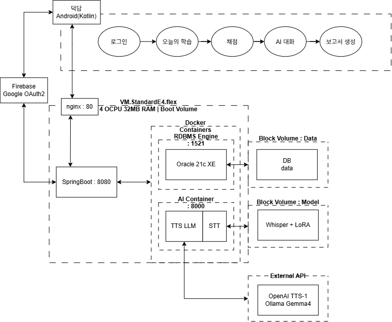
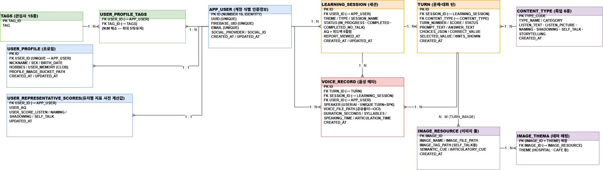

<div align="center">

# 덕담 (Duck談)

### LLM 기반 발화·대화 훈련 보조 서비스

**덕분이와 함께 언제 어디서나 부담 없이 말하고, 나의 발화 변화를 확인하세요**

*SeSAC TEAM 545 — 김윤혁 문현아 서지원 손승운 우연희*

</div>

---

## 💬 덕담은 무엇인가요?

말하기에 부담을 느끼는 분들을 위한 **매일 8분 AI 말하기 연습 앱**입니다.

1인 가구·사회적 고립의 확대로 **대화 상대가 줄어들면서 발화 기회 자체가 축소**되는 가운데,
전문 언어치료와 범용 AI 사이의 **공백**을 메우는 것을 목표로 설계했습니다.

| 특징 | 설명 |
|------|------|
| 🗣️ **구조화된 연습** | 알아듣기 → 이름대기 → 따라말하기 → 스스로말하기 4유형 문항을 매일 8분 |
| 📊 **근거 기반 평가** | K-WAB(웨스턴 실어증 배터리) AQ 산출식을 참고한 4영역 가중 결합 점수 (0~100) |
| 🤖 **AI 자유 대화** | 연습 결과·개인화 메모리를 반영한 마스코트 "덕분이"와의 대화 (최대 8턴) |
| 📈 **기록 누적** | 세션 단위 이력 저장으로 발화 수행의 **변화 양상** 추적 |

> 캐릭터 "덕분이"는 오리 — 앱 이름 **덕담(duck + 談)**은 오리와의 대화에서 왔습니다.

---

## 🧠 핵심 기술

### 1. LLM 기반 자발화 채점 (CIU)

"어… 남자.. 남자아이가…" 같은 발화에서 **의미 있는 단어(CIU)**를 판정하는 건
정량화가 불가능해 평가자의 판단에 맡겨질 수밖에 없던 영역입니다.

덕담은 그림·태그·발화를 LLM에 입력해 어절 단위로 **인정/중복/부정확/제외**를 판정하고,
이를 AQ 산출식에 반영해 일관된 기준의 수치화를 구현했습니다.

### 2. STT LoRA 파인튜닝

STT 변환 텍스트는 채점·AQ·AI 대화 **전 단계의 입력**입니다.
발화에 어려움을 겪는 사용자의 조음 특성을 반영하기 위해
**AI Hub 구음장애 음성 데이터(133명 화자, 5.04시간)**로
Whisper large-v3-turbo에 LoRA 어댑터(q/k/v/out, 0.8%)를 학습했습니다.

| 모델 | WER | CER | 완전정답 (30문항) |
|------|-----|-----|------|
| base | 28.6% | 12.5% | 37% |
| v1 (r=8, 증강 無) | 28.0% | 15.6% | 40% |
| **v2 (r=16, 증강 60%)** | **20.8%** | **11.7%** | **60%** |

### 3. 개인화

- **지표 기반 난이도 개인화** — 매 학습의 측정 지표를 DB에 반영해 다음 문항 난이도 조절
- **메모리 기반 맥락 개인화** — 대화에서 얻은 사용자 정보("요리를 즐긴다" 등)를 메모리로 축적해 문항 생성·대화 맥락에 활용

---

## 🏗️ 시스템 아키텍처

<p align="center">
  
</p>

```
[Android 앱]                      [Spring Boot Backend]              [FastAPI AI 서버]
 Kotlin · MVVM          ──HTTP──>  Kotlin · JPA · Security   ──────>  Whisper + LoRA STT
 구글 로그인 · 녹음                 Firebase 인증 · JWT                Ollama Cloud LLM
 ExoPlayer · MediaRecorder         세션/턴/리포트 도메인              OpenAI TTS
                                   AQ 산정 · 백그라운드 채점          CIU 채점 · 문항 생성
        │                                     │                                  │
        └──────────── nginx (reverse proxy) ──┴────────── Oracle XE 21c ──┘
```

| 언어 | 담당 영역 |
|------|----------|
| **Kotlin** | Android 앱 + Spring Boot 백엔드 — 화면·음성 녹음·인증·세션·API·데이터 연동 |
| **Python** | FastAPI AI 서버 — STT·TTS·LLM 연습 결과와 피드백 생성 |
| **SQL · HTML/CSS** | Oracle 스키마·마이그레이션, Jinja2 웹 관리자 페이지 |

---

## 🗄️ 데이터베이스 (ERD)

<p align="center">
  
</p>

> Oracle XE 21c — 사용자·세션·음성·콘텐츠 도메인 12테이블. 상세 설계는 [Documentations/04_Database_Design.md](https://github.com/2026SeSAC-Oracle-Team2/Documentations/blob/main/04_Database_Design.md) 참고.

---

## 📚 레포지토리 안내

| 레포 | 설명 |
|------|------|
| [SeSAC_SpeechApp_Client_Android](https://github.com/2026SeSAC-Oracle-Team2/SeSAC_SpeechApp_Client_Android) | 📱 Android 클라이언트 (덕담 최종본) |
| [SeSAC_SpeechApp_Backend](https://github.com/2026SeSAC-Oracle-Team2/SeSAC_SpeechApp_Backend) | ⚙️ Spring Boot 백엔드 |
| [SeSAC_SpeechApp_Container_AI](https://github.com/2026SeSAC-Oracle-Team2/SeSAC_SpeechApp_Container_AI) | 🤖 FastAPI AI 서버 (STT·TTS·LLM) |
| [SeSAC_SpeechApp_Container_DB](https://github.com/2026SeSAC-Oracle-Team2/SeSAC_SpeechApp_Container_DB) | 🗄️ Oracle XE 21c 컨테이너 |
| [SeSAC_SpeechApp_Deployment](https://github.com/2026SeSAC-Oracle-Team2/SeSAC_SpeechApp_Deployment) | 🚀 통합 docker-compose |
| [admin_page](https://github.com/2026SeSAC-Oracle-Team2/admin_page) | 🖥️ DB 웹 관리 콘솔 (FastAPI + Jinja2) |
| [Documentations](https://github.com/2026SeSAC-Oracle-Team2/Documentations) | 📄 기획·요구사항·API 계약·DB 설계·ADR |
| [SeSAC_SpeechApp_Client_dev](https://github.com/2026SeSAC-Oracle-Team2/SeSAC_SpeechApp_Client_dev) | 📱 Android 클라이언트 (개발 히스토리) |
| [speak-connect](https://github.com/2026SeSAC-Oracle-Team2/speak-connect) | 🎨 초기 기획·디자인 시안 |

---

## 🛠️ 기술 스택

`Kotlin` `Spring Boot` `FastAPI` `Oracle XE 21c` `Docker` `Firebase Auth`
`Whisper large-v3-turbo + LoRA` `Ollama Cloud` `OpenAI TTS` `Retrofit` `ExoPlayer(Media3)` `OCI Object Storage`

---

<div align="center">

*SeSAC (청년취업 아카데미) Oracle 프로젝트 — TEAM 545*

</div>